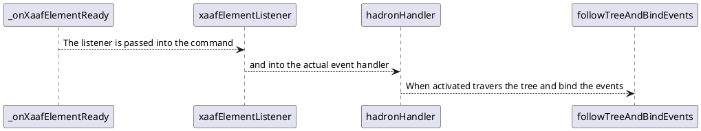

## Dynamic View

### Section X



#### Dynamic View Flow

1. The ShowDynamicCommand conatains an eventListener that is shared with the command implementation

```javascript
   protected _xaafDynamicElementListener: XaafDynamicElementListener = {
        onLoaded: () => {},
        onError: (error: XaafError) => {
            this._commandEventCreator.createErrorEvent(error);
        }
    };
```

2. When the element is ready we set the listener

```javascript
    protected _onXaafElementReady(xaafDynamicElement: XaafDynamicElement, commandModel: CommandModel): void {
        this._updateAndReturnCurrentState(State.Ready);
        xaafDynamicElement.xaafElementListener = this._xaafDynamicElementListener;
        xaafDynamicElement.setData(this._convertToXaafDynamicElementData(commandModel.data));
    }
```

3. The event listener is invoked from the DynamicView implemantation on the platform side code (hadron)

```javascript
// hbo/events-handler.ts
    private _refListener: (view: OopType<"View">) => void = view => {
        this._dynamicViewRef = view;
        if (this._dynamicViewRef && this._dynamicViewData.xaaf) {
            hadronHandler(view, this._dynamicViewData, this.xaafElementListener);
        }
    };

```

5. We continue to analyze the view and the data and build the events handling procedures (hadron-sdk). The first step is to filter out only the elements we want to observe

```javascript
// hbo/events-handler.ts
export class EventsMonitor {
    public xaafDynamicElementListener: IXaafDynamicElementListener;
    public childCounter: number;
    public targetCount: number;
    public topView: OopType<"View">;
    public loadTimeOut?: number;
    public loadTimeOutMs?: number;
    public events: Record<string, IEventAction[]>;
}
```

6. `followTreeAndBindEvents` function is doing the actual event monitoring, when the event is triggered it triggers the onLoad function, indicating the resource was loaded.

```javascript
// hbo/events-handler.ts
switch (event.action) {
  case "Loaded":
    eventsMonitor.loadTimeOut = setTimeout(() => {
      eventsMonitor.xaafDynamicElementListener.onError(
        new Error("timeout error")
      );
    }, eventsMonitor.loadTimeOutMs);
    if (child.___pending) {
      await onLoad(child, eventsMonitor);
    }
    break;
  case "AnimationStart":
    break;
  case "AnimationEnd":
    break;
}
```

7. `onLoad` will either increment the childCounter and check if we've reached our target count, or fail the command to hide it.

```javascript
// hadron-events-handler.ts
async function onLoad(
  child: IHadronChild,
  eventsMonitor: EventsMonitor
): Promise<void> {
  eventsMonitor.targetCount++;
  child.___pending.promise
    .then(() => {
      eventsMonitor.childCounter++;
      if (eventsMonitor.childCounter === eventsMonitor.targetCount) {
        eventsMonitor.topView.isVisible = true;
        clearTimeout(eventsMonitor.loadTimeOut);
        eventsMonitor.xaafDynamicElementListener.onLoaded();
      }
    })
    .catch((error) => {
      eventsMonitor.xaafDynamicElementListener.onError(
        new Error("resource error")
      );
    });
}
```

### Action/Name event pairs

> [!NOTE]
> Each event has a mandatory field: `name` - the name of the event in the code, and an optional field `action` which may be used as an alias to the actual event.

#### XIP example for events

```Javascript
{
    type: 'View',
    xaaf:{
      events:[{action: 'Loaded', timeout: 1000 * 5 }]
    }
    props: {
    },
    children: [
        {
            type: 'TouchableOpacity',
            events: [{action:'Loaded', name:'onReady'}],
            props: {},
            children: [
                  {
                    type: 'Text',
                    xaaf:{
                        events: [
                           {action:'Loaded', name:'onReady'},// this element will report the events listed
                           {action:'Show', name:'onVisible'},
                           {action:'Click', name:'onClick'},
                        ],
                     },
                      props: {},
                      children: ['Click Me']
                  }
              ]
        },
        {
            type: 'Image',
            xaaf:{
                events: ['onReady:Loaded']
            }
            props: {}
        }
    ]
}
```

## Component events

The dynamic view container will propagate the handled events using component callbacks going back to the consumers.

Acceptable values per element in the XIP input

| Event           | Description                                | bind information | correlated event handler  |
| :-------------- | :----------------------------------------- | :--------------- | :------------------------ |
| **Life cycle**  |                                            |                  |                           |
| Loaded          | Mainly used be image/resouce element type  | `DVevent`        | `onElementLoaded`         |
| Show            | When the element visibility changes        | `DVevent`        | `onElementShow`           |
| Hide            | When the element visibility changes        | `DVevent`        | `onElementHide`           |
| Remove          | When the element is cleared from the dom   | `DVevent`        | `onElementRemoved`        |
| **Animation**   |                                            |                  |                           |
| AnimationStart  | Trigger at animation start                 | `DVevent`        | `onElementAnimationStart` |
| AnimationFrame  | Trigger for every animation frame interval | `DVevent`        | `onElementAnimationFrame` |
| AnimationEnd    | Trigger at animation end                   | `DVevent`        | `onElementAnimationEnd`   |
| **Interactive** |                                            |                  |                           |
| Click           | Allows an element to trigger a click event | `DVevent`        | `onElementClick`          |
| Focus           | Allows an element to be clicked            | `DVevent`        | `onElementFocus`          |
| Blur            | Text                                       | `DVevent`        | `onElementBlur`           |

> Since loaded event is critical for the SDK too, maybe it should be a default constant value.

These events will be triggered using the following interface and enums.

```typescript
interface IElementEvent {
  name: XaafEvents;
  el: JSX.Element;
  animation: {
    frame: number;
    duration: number;
  };
}

enum XaafEvents {
  onElementLoaded,
  onElementHide,
  onElementRemoved,
  onElementClick,
  onElementFocus,
  onElementBlur,
  onElementAnimationStart,
  onElementAnimationFrame,
  onElementAnimationEnd,
  onCompositionLoaded,
  onCompositionRendered,
  onCompositionError,
}
```

```typescript
onElementLoaded(($event: Event));
onElementShow(($event: Event));
onElementHide(($event: Event));
onElementRemoved(($event: Event));

onElementClick(($event: Event));
onElementFocus(($event: Event));
onElementBlur(($event: Event));

onElementAnimationStart(($event: Event));
onElementAnimationFrame(($event: Event));
onElementAnimationEnd(($event: Event));
```

Some events are not bound to Xip as they are general events

```typescript
onCompositionLoaded(($event: Event)); // all the elements are loaded
onCompositionRendered(($event: Event)); // all elements are visible
onCompositionError(($error: Error)); // an error has occured
```

### Global events logic

#### onCompositionLoaded

Using the known number of elements with the `Loaded` event to check when all the elements are loaded. Each element will fire an `onElementLoaded` event.

#### onCompositionRendered

Using the known number of elements with the `Show` event to check when all the elements are loaded. Each element will fire an `onElementShow` event.

#### onCompositionError

Errors may occur in various locations of the components.

| Error                | Description                                           |                                                                   |
| :------------------- | :---------------------------------------------------- | :---------------------------------------------------------------- |
| **Loading**          |                                                       |                                                                   |
| LoadingTimeoutError  | Set a timeout for loading events to complete.         | At the end of the timeout a `LoadingTimeoutError` will be thrown. |
| _TBD_                |                                                       |                                                                   |
| ContentMismatchError | the content ration doesn't much the hosting component | match the elements dimensions with the hosting component size     |
