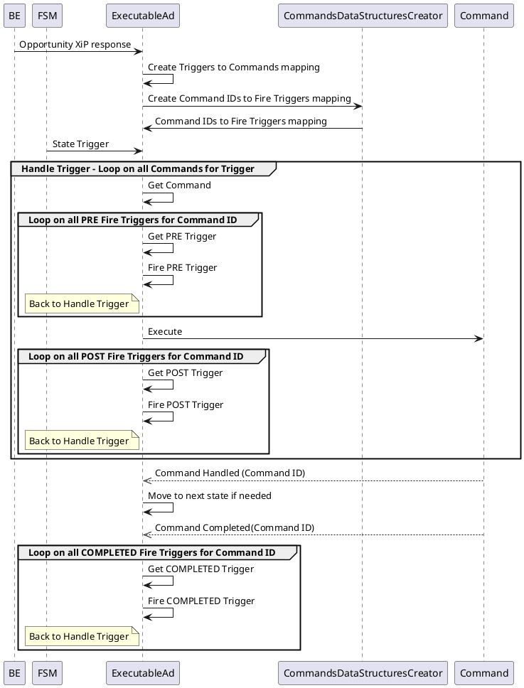

## Fire Triggers

### Motivation

XAAF JS SDK should support fire triggers as was implemented by native platforms.
Each command contained in XiP response may include a list of triggers to fire upon any of the following:

1. Pre-execution of the command
2. Post-execution of the command
3. Command's operation completion (for example, when a SHOW_VIDEO command's video playback completes)

Once a trigger is fired as a result of any of the above, it behaves like any other trigger (state trigger) - will trigger the execution of any command which has it as its execution trigger. 

### Example of fire triggers element in XiP response command
```JSON
{
  "id": 1,
  "commandName": "SHOW_VIDEO",
  "data": {
    "url": "http://itvads.dtvcdn.com/itv_csads/A060485536F0.mp4",
    "transparent": false,
    "videoRepeatCount": 1,
    "autoPlay": "false",
    "muted": true,
    "zOrder": "background",
    "preload": true
  },
  "fireTriggers": [
    {
      "mode": "COMPLETED",
      "name": "UNSQUEEZE"
    }
  ],
  "executionTriggers": [
    {
      "trigger": "STATE_STARTING"
    }
  ]
}
```

### Execution Flow



As can be seen, firing fire-triggers and handling them is done by the ExecutableAd itself.

### Testing Strategy

Currently, any code realted to this feature is tested using only unit tests.


